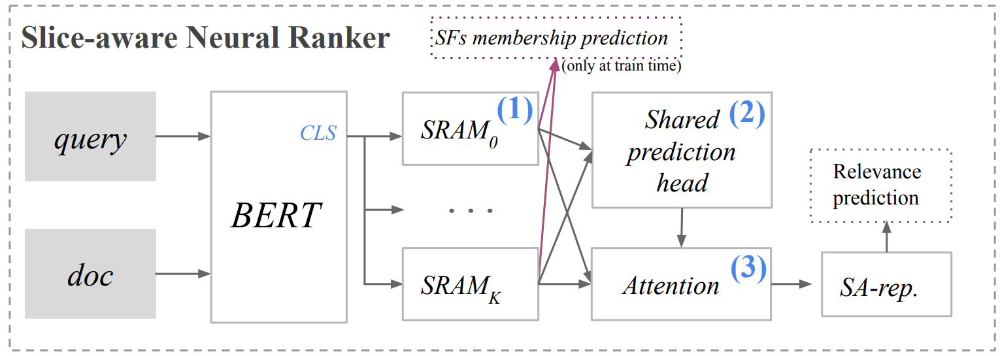
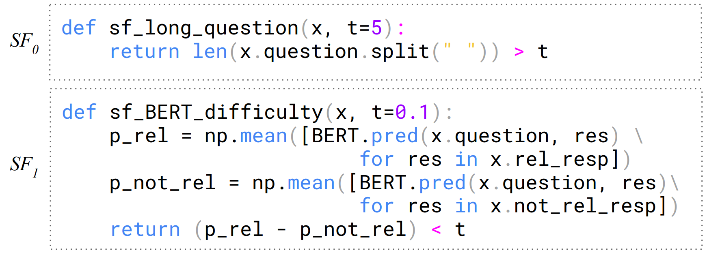

## Slice-Aware Neural Ranking

This repo has the source code for the SCAI'20 paper _'Slice-Aware Neural Ranking'_. It has two base libraries forked in the project to do so Huggingface transformers (for fine-tunning BERT) and snorkel (for the SRAMs). The _ir_slices_ folder contains the source code for the slicing functions specific to the conversational tasks and the retrieval domain. The model is a simple adaptation of the Slice-based learning (https://arxiv.org/pdf/1909.06349.pdf) for ranking models using BERT as the backbone.

<p align="center">

</p>

On the paper we focus on finding slices of data for which neural ranking models might be ineffective. To do so we use slicing functions (SFs) that are functions that return a boolean indicating if an instance belongs to that slice or not. See two examples below:

<p align="center">

</p>


The SFs are implemented on ir_slices/ir_slices/slice_functions.py. In order to run the experiments, first do the following to install dependencies:

```bash
#Create a virtual env
python3 -m venv env
source env/bin/activate    

#Install the requirements
pip install -r requirements.txt
cd snorkel/snorkel
pip install -e .
cd ../../transformers
pip install -e .
cd ../ir_slices
pip install -e .
```

Now in order to run the model:

```bash
python ./transformers/examples/run_glue.py \
     --model_type $MODEL \
     --model_name_or_path bert-base-uncased \
     --task_name $TASK \
     --do_train \
     --do_eval \
     --do_lower_case \
     --data_dir $DATA_DIR/$TASK \
     --max_seq_length $MAX_SEQ_LENGTH \
     --per_gpu_eval_batch_size=$BATCH_SIZE  \
     --per_gpu_train_batch_size=$BATCH_SIZE  \
     --learning_rate 2e-5 \
     --num_train_epochs $NUM_EPOCHS \
     --output_dir $DATA_DIR/${TASK}_output \
     --overwrite_output_dir \
     --seed $RANDOM_SEED \
     --save_steps 10000000 \
     --save_model \
     --evaluate_on 'test'
```
Where MODEL can be ['bert', 'bert-slice-aware' or 'bert-slice-aware-random-slices']. The datasets have to be downloaded and added to DATA_DIR/TASK first. Download the datsets from their respective repositories: https://guzpenha.github.io/MANtIS/ ; https://ciir.cs.umass.edu/downloads/msdialog/ ; https://ciir.cs.umass.edu/downloads/Antique/ and https://www.kaggle.com/c/quora-question-pairs.
